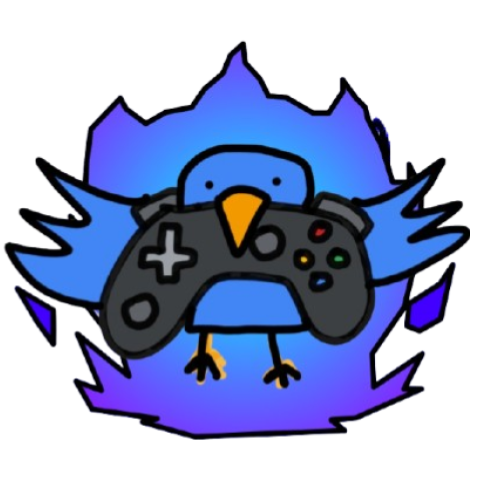

<div align="center">
  
</div>

## BirdHub V2
BirdHub V2 is a web-based portal for online browser games. It is a remade-from-the-ground-up version of the [original BirdHub](https://github.com/AnonymousBirb5100/anonymousbirb5100.github.io). BirdHub V2 has a much sleeker design and more features while still retaining the intuivity of its predecessor.
> [!IMPORTANT]
> This website, along with this README, is still under heavy development. This README is subject to frequent changes!

### ✨ Main Features
* All games are stored in the Github repositiory (```/games```) instead of in countless separate repositories. The original repositories are still there, though.
* All CSS size-related values (e.g. width, height, font-size) use ```vw``` or ```vh``` instead of ```px```, making them dynamic with the screen size. This makes BirdHub V2 compatible on all screen sizes to some degree.
* More visually appealing design elements, such as a dynamic particle background, while still keeping the website optimized.
* Uses JavaScript to add new game buttons (instead of having to manually copy-and-paste and change the values), making adding new games much easier.
* More features, such as search bars, filters, and some dynamically updating sections. I love the word "dynamic" :D
* Retains a user-friendly interface and ease of navigation. Not too empty, not too cluttered.
### Current Links
*"Links" refers to alternative URLs in case some are blocked in your region. They all contain the same verison.*
| Link | Status |
|---------|-------------|
| https://play.birdhubofficial.net (Main Link) | In Progress |
| https://anonymousbirb5100.github.io/birdhub-v2 | Live |
| https://birdhubgames.vercel.app | Live |
| https://bhubcentral.github.io | In Progress |
| https://birbcade.pages.dev | In Progress |
